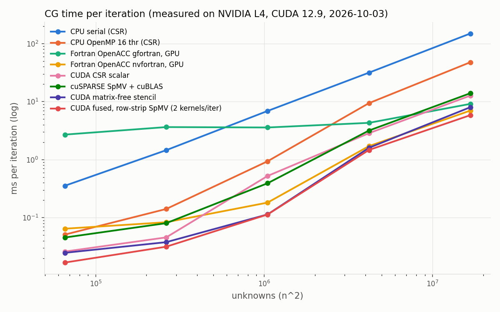
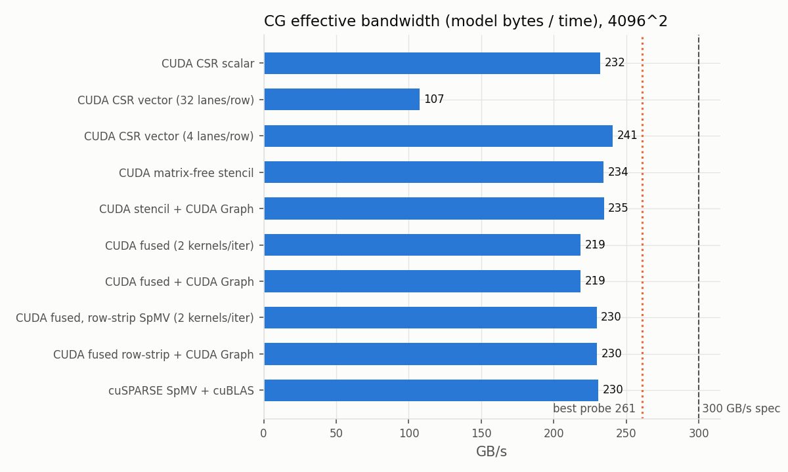
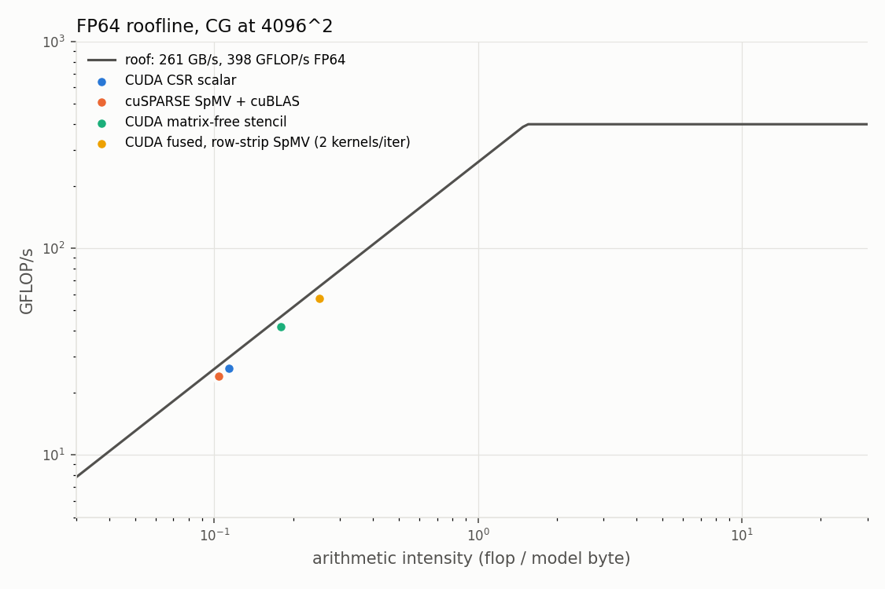
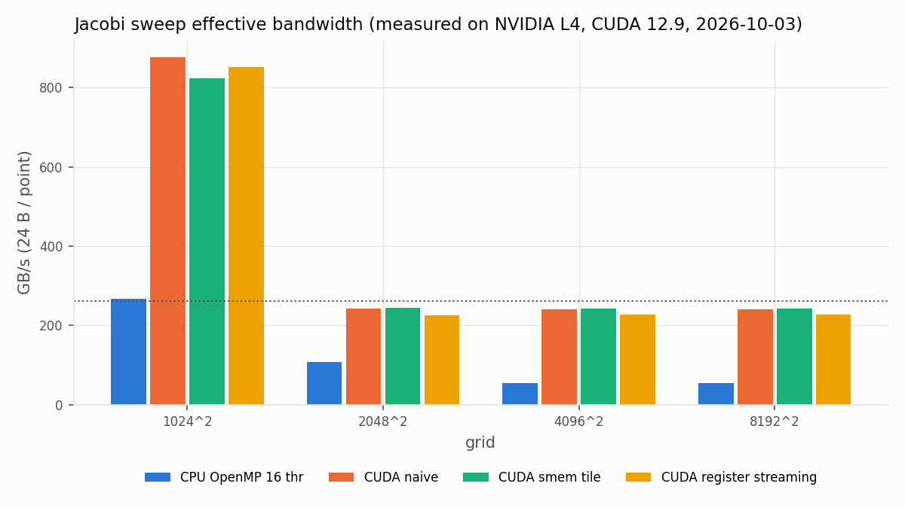

# cuda-solver-lab

Results page with plots: https://huggingface.co/spaces/pavanyadava07/cuda-solver-lab - author: Pavan Yadav Annappa (MIT licence).

Conjugate Gradient and Jacobi solvers for the 2D Poisson equation, written as a
GPU performance study: a serial C++ reference, OpenMP, eight hand-written CUDA
variants (CSR scalar / vector SpMV, matrix-free stencil, warp-shuffle
reductions, fused kernels, CUDA Graphs), cuSPARSE + cuBLAS as the library
reference, three Jacobi stencil kernels, and a Fortran OpenACC version built
with both gfortran (nvptx offloading) and NVIDIA's nvfortran, plus an nvfortran
`do concurrent` (`-stdpar=gpu`) build of the same loops. Every variant is checked
against the CPU reference and an analytic solution, every timing is turned into
bandwidth and placed on a measured roofline, and the key kernels are profiled
with Nsight Compute.

All numbers below are produced by `./run_all.sh` on one machine: NVIDIA L4
(Ada, sm_89, 24 GB GDDR6 with ECC on, 48 MB L2), driver 580, CUDA 12.9,
AMD EPYC 7R13 (16 cores / 32 threads), gcc/gfortran 11.5, NVIDIA HPC SDK 26.9
(nvfortran, using the same CUDA 12.9). They are copied into
this file by `scripts/make_report.py` from the raw CSV files in `results/raw/`
and the Nsight exports in `results/ncu/` and `results/nsys/`; none are typed
by hand.

## Problem

-Laplace(u) = f on the unit square, u = 0 on the boundary, 5-point stencil on an
n x n interior grid (h = 1/(n+1)), system scaled by h^2 so the matrix has 4 on
the diagonal and -1 for the four neighbours. The manufactured solution is
u = g(x) g(y) with g(t) = t (1 - t) e^t (see `include/poisson.hpp`; the
textbook sin(pi x) sin(pi y) is a discrete eigenvector and makes CG converge in
one iteration, see `docs/DEVLOG.md`). FP64 throughout.

## What is in the repo

| Path | What |
|---|---|
| `include/poisson.hpp` | grid, CSR assembly, right-hand side, analytic solution, a-priori error bound |
| `src/host/cg_host.hpp`, `cg_cpu.cpp` | CPU CG (CSR SpMV + dot + axpy); built as `cg_serial` and `cg_omp` from one source |
| `src/cuda/cg_kernels.cuh` | all CG kernels: SpMV variants, warp-shuffle block reduction, in-kernel grid reduction ("last block done"), fused kernels |
| `src/cuda/cg_cuda.cu` | GPU CG driver: variants, CUDA Graph capture, cuSPARSE/cuBLAS path, timing, checks |
| `src/cuda/jacobi.cu` | Jacobi: naive, shared-memory tile, register streaming, CPU OpenMP baseline |
| `src/cuda/bw_probe.cu` | measured ceilings: copy / triad / read / write bandwidth, FP64 and FP32 FMA throughput |
| `src/acc/cg_acc.F90` | matrix-free CG in Fortran + OpenACC: gfortran (`cg_acc_gpu`), nvfortran (`cg_acc_nvf`), nvfortran `do concurrent` with `-DUSE_DC` (`cg_dc_nvf`), and the same file serial (`cg_acc_host`) |
| `tests/` | ctest helpers: second-order convergence check, "Fortran really ran on the GPU" checks for gfortran and nvfortran |
| `scripts/` | `build.sh`, `sanitize.sh`, `bench.sh`, `profile.sh`, `profile_fortran.sh`, `make_report.py` |
| `results/` | raw CSV, Nsight Compute / Systems exports, sanitizer logs, nvfortran `-Minfo` output (`minfo/`), figures, `RESULTS.md` |
| `docs/DEVLOG.md` | the bugs hit while building this and how each was found |

### CG variants

Every GPU variant runs the same unpreconditioned CG with all scalars (alpha,
beta, r.r) kept in device memory: dot products finish inside the kernel with
the "last block done" pattern (block partials, `__threadfence`, atomic ticket,
last block reduces and updates the scalars), so the iteration loop never waits
for the host.

| Variant | Iteration = | Model DRAM bytes / iteration |
|---|---|---|
| `csr_scalar` | CSR SpMV one thread per row + 5 BLAS-1 kernels | 12 nnz + 20 N + 96 N |
| `csr_vector32` | CSR SpMV one warp per row (shuffle reduce) + 5 BLAS-1 | same |
| `csr_vector4` | CSR SpMV 4 lanes per row + 5 BLAS-1 | same |
| `stencil` | matrix-free SpMV + 5 BLAS-1 | 16 N + 96 N |
| `fused` | (1) p = r + beta p, Ap = A p, p.Ap in one pass; (2) x += alpha p, r -= alpha Ap, r.r in one pass | 32 N + 48 N |
| `fused_rows` | as `fused`, but kernel (1) walks row strips (up to 32 rows, fewer on small grids) with register / shuffle neighbour reuse | 32 N + 48 N |
| `*_graph` | the same iteration captured into a CUDA Graph (10 iterations per graph launch) | same |
| `cusparse` | `cusparseSpMV` (CSR) + `cublasDdot/Daxpy/Dscal` in device pointer mode | 12 nnz + 20 N + 112 N |
| CPU serial / OpenMP | CSR, same 6 steps as `csr_scalar` | 12 nnz + 20 N + 96 N |
| Fortran OpenACC | matrix-free, three `parallel loop` regions with reductions | 16 N + 48 N + 24 N |
| Fortran `do concurrent` | the same three loops as `do concurrent ... reduce(+:s)`, arrays in CUDA managed memory | same |

N = unknowns, nnz = nonzeros (about 5 N). The model counts each array touched by
a kernel once (perfect cache reuse of the SpMV source vector) and is the
denominator for "effective bandwidth". Flops per iteration are counted the same
way for every variant (2 nnz + 10 N), so GFLOP/s are comparable.

Fusing removes the separate `p = r + beta p` pass by recomputing p at the four
neighbours inside the SpMV (p is double-buffered because neighbours must see the
old value), and merges the two axpys with the r.r reduction: 6 kernels and
112 N bytes become 2 kernels and 80 N bytes.

## Correctness

* Every CUDA variant, both CPU builds and both Fortran builds solve to a
  relative residual of 1e-10 in ctest; the true residual ||b - Ax|| / ||b|| is
  recomputed on the host in long double, the max error against the analytic
  solution must be inside the a-priori discretisation bound
  (h^2/96) sup|u_xxxx + u_yyyy| (discrete maximum principle), and each GPU
  solution must match the CPU reference solution.
* `second_order_convergence`: halving h must cut the error by about 4x.
* `jacobi_gpu_matches_cpu`: all three Jacobi kernels against the CPU after 500
  sweeps on a 257^2 grid (a size that is not a multiple of any tile).
* `fortran_openacc_runs_on_gpu`: runs with `GOMP_DEBUG=1` and requires nvptx
  kernel launches in the log, so a silent host fallback fails the test.
  `nvfortran_openacc_runs_on_gpu` and `nvfortran_do_concurrent_runs_on_gpu` do
  the same with `NV_ACC_NOTIFY=1` (one "launch CUDA kernel" line per launch).
* compute-sanitizer memcheck, racecheck, synccheck and initcheck for every CG
  variant and the Jacobi binary (`scripts/sanitize.sh`, logs in
  `results/sanitizer/`).

## Reproduce

```bash
./run_all.sh        # or: make bench
```

This builds (CMake, `-arch=sm_89`), runs ctest, the sanitizers, all
benchmarks, the Nsight Compute / Systems profiles and regenerates the results
section below plus `results/RESULTS.md` and `results/figures/*.png`. About 15
minutes on an idle L4. Requirements: CUDA 12.x (`CUDA_HOME`, default
`/usr/local/cuda-12.9`), gcc/g++/gfortran with OpenMP, `gcc-offload-nvptx` for
the OpenACC build (`-DBUILD_OPENACC=OFF` to skip), `uv` for the plotting venv.
Optional: the NVIDIA HPC SDK for the nvfortran builds; CMake looks for
`nvfortran` on `PATH`, under `$NVHPC_ROOT/compilers/bin` and in
`~/opt/nvhpc` (see `docs/DEVLOG.md` for the trimmed tarball install) and skips
those targets and tests if it is not found (`-DBUILD_NVFORTRAN=OFF` to skip).
Nsight Compute needs GPU performance counter access; on this host that means
passwordless `sudo` (see results). `bench.sh` waits until no other process
uses the GPU and logs what it saw in `results/raw/gpu_contention.log`.

Single runs:

```bash
build/cg_cuda --variant all --n 512 --mode tol --tol 1e-10 --ref       # correctness, all variants
build/cg_cuda --variant fused_rows --n 4096 --mode fixed --iters 100   # timing
build/jacobi --n 4096 --sweeps 100 --cpu
build/cg_acc_gpu 1024 tol 100000 1e-8
NV_ACC_NOTIFY=1 build/cg_acc_nvf 255 tol 100000 1e-10                  # prints every kernel launch
```

## Results






<!-- RESULTS:BEGIN -->
_All numbers: measured on NVIDIA L4, CUDA 12.9, 2026-10-03. Generated by `scripts/make_report.py` from `results/raw/`._

### Hardware ceilings (bw_probe)

| probe | best of 20 | % of 300 GB/s spec |
|---|---|---|
| copy_f64 | 232.4 GB/s | 77.5 % |
| copy_f64x2 | 233.3 GB/s | 77.8 % |
| triad_f64 | 237.8 GB/s | 79.3 % |
| read_f64 | 261.0 GB/s | 87.0 % |
| write_f64 | 241.2 GB/s | 80.4 % |
| memcpy_d2d | 232.3 GB/s | 77.5 % |
| fma_f64 | 398 GFLOP/s |  |
| fma_f32 | 25,415 GFLOP/s |  |

Best measured bandwidth: **261.0 GB/s** (87.0 % of the 300 GB/s datasheet value; ECC is enabled on this GPU). FP64 FMA peak: **398 GFLOP/s** (FP32/FP64 = 64). FP64 ridge point = 398 / 261.0 = **1.53 flop/byte**.

### CG: time per iteration (ms), fixed iteration count

| implementation | 256^2 | 512^2 | 1024^2 | 2048^2 | 4096^2 |
|---|---|---|---|---|---|
| CPU serial (CSR) | 0.355 | 1.456 | 6.911 | 31.628 | 149.644 |
| CPU OpenMP 16 thr (CSR) | 0.051 | 0.141 | 0.938 | 9.427 | 47.801 |
| CPU OpenMP 32 thr (CSR) | 0.069 | 0.145 | 1.013 | 10.022 | 52.209 |
| Fortran OpenACC gfortran, GPU | 2.703 | 3.644 | 3.585 | 4.310 | 9.152 |
| Fortran OpenACC nvfortran, GPU | 0.064 | 0.083 | 0.182 | 1.711 | 7.014 |
| Fortran do concurrent nvfortran, GPU | 0.037 | 0.057 | 0.167 | 1.795 | 7.791 |
| CUDA CSR scalar | 0.026 | 0.046 | 0.523 | 2.860 | 12.718 |
| CUDA CSR vector (32 lanes/row) | 0.089 | 0.296 | 1.347 | 6.371 | 27.520 |
| CUDA CSR vector (4 lanes/row) | 0.031 | 0.059 | 0.528 | 2.821 | 12.273 |
| CUDA matrix-free stencil | 0.025 | 0.038 | 0.114 | 1.600 | 8.018 |
| CUDA stencil + CUDA Graph | 0.021 | 0.034 | 0.121 | 1.592 | 8.013 |
| CUDA fused (2 kernels/iter) | 0.018 | 0.033 | 0.124 | 1.437 | 6.141 |
| CUDA fused + CUDA Graph | 0.017 | 0.032 | 0.131 | 1.437 | 6.143 |
| CUDA fused, row-strip SpMV (2 kernels/iter) | 0.017 | 0.032 | 0.113 | 1.468 | 5.848 |
| CUDA fused row-strip + CUDA Graph | 0.015 | 0.030 | 0.107 | 1.470 | 5.841 |
| cuSPARSE SpMV + cuBLAS | 0.045 | 0.080 | 0.392 | 3.176 | 13.975 |

### CG at 4096^2 (16,777,216 unknowns): bandwidth, roofline, speedups

| implementation | ms/iter | model MB/iter | eff. GB/s | % of 300 GB/s | GFLOP/s | flop/byte | vs CPU serial | vs cuSPARSE |
|---|---|---|---|---|---|---|---|---|
| CPU serial (CSR) | 149.644 | 2,953 | 19.7 | - | 2.2 | 0.114 | 1.0x | 0.09x |
| CPU OpenMP 16 thr (CSR) | 47.801 | 2,953 | 61.8 | - | 7.0 | 0.114 | 3.1x | 0.29x |
| CPU OpenMP 32 thr (CSR) | 52.209 | 2,953 | 56.6 | - | 6.4 | 0.114 | 2.9x | 0.27x |
| Fortran OpenACC gfortran, GPU | 9.152 | 1,476 | 161.3 | 53.8 | 36.7 | 0.227 | 16.4x | 1.53x |
| Fortran OpenACC nvfortran, GPU | 7.014 | 1,476 | 210.5 | 70.2 | 47.8 | 0.227 | 21.3x | 1.99x |
| Fortran do concurrent nvfortran, GPU | 7.791 | 1,476 | 189.5 | 63.2 | 43.1 | 0.227 | 19.2x | 1.79x |
| CUDA CSR scalar | 12.718 | 2,953 | 232.2 | 77.4 | 26.4 | 0.114 | 11.8x | 1.10x |
| CUDA CSR vector (32 lanes/row) | 27.520 | 2,953 | 107.3 | 35.8 | 12.2 | 0.114 | 5.4x | 0.51x |
| CUDA CSR vector (4 lanes/row) | 12.273 | 2,953 | 240.6 | 80.2 | 27.3 | 0.114 | 12.2x | 1.14x |
| CUDA matrix-free stencil | 8.018 | 1,879 | 234.4 | 78.1 | 41.8 | 0.179 | 18.7x | 1.74x |
| CUDA stencil + CUDA Graph | 8.013 | 1,879 | 234.5 | 78.2 | 41.9 | 0.179 | 18.7x | 1.74x |
| CUDA fused (2 kernels/iter) | 6.141 | 1,342 | 218.6 | 72.9 | 54.6 | 0.250 | 24.4x | 2.28x |
| CUDA fused + CUDA Graph | 6.143 | 1,342 | 218.5 | 72.8 | 54.6 | 0.250 | 24.4x | 2.28x |
| CUDA fused, row-strip SpMV (2 kernels/iter) | 5.848 | 1,342 | 229.5 | 76.5 | 57.4 | 0.250 | 25.6x | 2.39x |
| CUDA fused row-strip + CUDA Graph | 5.841 | 1,342 | 229.8 | 76.6 | 57.4 | 0.250 | 25.6x | 2.39x |
| cuSPARSE SpMV + cuBLAS | 13.975 | 3,221 | 230.5 | 76.8 | 24.0 | 0.104 | 10.7x | 1.00x |

Roofline: the fused CG iteration does 0.25 flop/byte against a ridge point of 1.53 flop/byte, so the attainable rate is bandwidth x intensity = 65 GFLOP/s, 16.4 % of FP64 peak: CG is memory bound by a factor of 6.1, and the only lever is bytes moved per iteration.

Speedups at 4096^2 (best GPU variant = CUDA fused row-strip + CUDA Graph): **25.6x** vs CPU serial, **8.2x** vs best CPU OpenMP, **2.39x** vs cuSPARSE + cuBLAS; CPU OpenMP vs serial: 3.1x.

Fortran at 4096^2: gfortran OpenACC 9.152 ms/iter; Fortran OpenACC nvfortran, GPU 7.014 ms/iter (1.30x faster than gfortran, 1.20x the time of the best CUDA variant, 6.8x faster than best CPU OpenMP); Fortran do concurrent nvfortran, GPU 7.791 ms/iter (1.17x faster than gfortran, 1.33x the time of the best CUDA variant, 6.1x faster than best CPU OpenMP).

Launch-bound regime (256^2, everything L2 resident): stencil 24.8 us/iter -> 20.7 us with a CUDA Graph (1.20x); fused 17.9 -> 16.7 us (1.08x). At 4096^2 the graph changes stencil by 1.001x (launch cost is hidden behind ms-long kernels).

### CG time to solution, 1024^2, relative residual 1e-8

| implementation | iterations | seconds | true rel. residual | max error vs analytic | vs CPU serial |
|---|---|---|---|---|---|
| CUDA CSR scalar | 3152 | 1.681 | 9.95e-09 | 8.857e-08 | 12.9x |
| CUDA CSR vector (32 lanes/row) | 3152 | 4.454 | 9.95e-09 | 8.857e-08 | 4.9x |
| CUDA CSR vector (4 lanes/row) | 3152 | 1.697 | 9.95e-09 | 8.857e-08 | 12.8x |
| CUDA matrix-free stencil | 3152 | 0.445 | 9.95e-09 | 8.857e-08 | 48.8x |
| CUDA stencil + CUDA Graph | 3160 | 0.418 | 9.28e-09 | 8.857e-08 | 51.9x |
| CUDA fused (2 kernels/iter) | 3152 | 0.461 | 9.95e-09 | 8.857e-08 | 47.1x |
| CUDA fused + CUDA Graph | 3160 | 0.450 | 9.28e-09 | 8.857e-08 | 48.1x |
| CUDA fused, row-strip SpMV (2 kernels/iter) | 3152 | 0.400 | 9.95e-09 | 8.857e-08 | 54.3x |
| CUDA fused row-strip + CUDA Graph | 3160 | 0.392 | 9.28e-09 | 8.857e-08 | 55.2x |
| cuSPARSE SpMV + cuBLAS | 3152 | 1.296 | 9.95e-09 | 8.857e-08 | 16.7x |
| CPU serial (CSR) | 3152 | 21.679 | 9.95e-09 | 8.857e-08 | 1.0x |
| CPU OpenMP 16 thr (CSR) | 3152 | 2.855 | 9.95e-09 | 8.857e-08 | 7.6x |
| Fortran OpenACC gfortran, GPU | 3152 | 11.373 | 9.95e-09 | 8.857e-08 | 1.9x |
| Fortran OpenACC nvfortran, GPU | 3152 | 0.599 | 9.95e-09 | 8.857e-08 | 36.2x |
| Fortran do concurrent nvfortran, GPU | 3152 | 0.551 | 9.95e-09 | 8.857e-08 | 39.3x |

GPU solves check the residual every iteration (graph variants every 10), which adds a device-to-host copy per check; it is included in these times.

### Jacobi sweep: effective bandwidth (GB/s, 24 B per point update)

| kernel | 1024^2 | 2048^2 | 4096^2 | 8192^2 |
|---|---|---|---|---|
| CPU OpenMP 16 threads | 266.6 (0.094 ms) | 107.0 (0.941 ms) | 54.6 (7.370 ms) | 54.0 (29.825 ms) |
| CUDA naive (global loads) | 875.8 (0.029 ms) | 242.7 (0.415 ms) | 241.5 (1.667 ms) | 241.0 (6.682 ms) |
| CUDA shared-memory tile 32x8 | 822.5 (0.031 ms) | 245.3 (0.410 ms) | 243.0 (1.657 ms) | 243.2 (6.623 ms) |
| CUDA register streaming (16 rows/thread) | 850.4 (0.030 ms) | 225.4 (0.447 ms) | 227.7 (1.768 ms) | 227.6 (7.075 ms) |

### Nsight Compute, one launch per kernel at 4096^2 (`ncu --set full`)

| profile | duration ms | DRAM % of peak | DRAM GB/s | DRAM read MB | DRAM write MB | achieved occ. % | theor. occ. % | sectors/request (global ld) | L2 hit % | regs/thread |
|---|---|---|---|---|---|---|---|---|---|---|
| spmv_csr_scalar | 5.923 | 95.0 | 284.6 | 1,529 | 157 | 98.8 | 100 | 18.41 | 47.2 | 40 |
| spmv_csr_vector32 | 45.625 | 19.4 | 58.2 | 2,445 | 211 | 80.8 | 100 | 1.80 | 41.3 | 39 |
| spmv_csr_vector4 | 5.359 | 96.1 | 288.1 | 1,392 | 152 | 99.8 | 100 | 5.09 | 28.9 | 40 |
| cusparse_spmv | 5.443 | 95.7 | 286.9 | 1,423 | 138 | 72.8 | 75 | 5.92 | 28.0 | 56 |
| spmv_stencil | 1.360 | 82.7 | 247.9 | 199 | 138 | 84.9 | 100 | 8.40 | 69.1 | 34 |
| dot_finalize | 1.072 | 96.5 | 289.3 | 308 | 2 | 96.4 | 100 | 8.00 | 0.1 | 36 |
| fused_p_spmv_dot | 3.279 | 85.5 | 256.3 | 539 | 301 | 91.2 | 100 | 8.39 | 58.4 | 40 |
| fused_rows_p_spmv_dot | 2.459 | 85.9 | 257.5 | 336 | 297 | 98.5 | 100 | 3.43 | 52.3 | 36 |
| fused_xr_dot | 3.426 | 87.8 | 263.0 | 614 | 287 | 98.4 | 100 | 7.99 | 33.4 | 38 |

First fused kernel, model traffic 537 MB (read r, p_old; write p_new, Ap): the 1D grid-stride version moves 840 MB (reads 2.01x the model), the row-strip version 633 MB (reads 1.25x); kernel time 3.28 -> 2.46 ms under ncu.


ncu locks clocks to base during profiling, so durations differ slightly from the timed runs. Sectors/request is averaged over all global loads of the kernel: a fully coalesced warp load touches 8 sectors (32 B each) for 8-byte values and 4 for 4-byte values; higher means scattered accesses.

Unprivileged `ncu` on this host fails with:

```
==ERROR== ERR_NVGPUCTRPERM - The user does not have permission to access NVIDIA GPU Performance Counters on the target device 0. For instructions on enabling permissions and to get more information see https://developer.nvidia.com/ERR_NVGPUCTRPERM
```

(RmProfilingAdminOnly=1), so the profiles were taken with passwordless `sudo`.

### Nsight Systems kernel census, cuSPARSE + cuBLAS path (n = 1024, 10 warm-up + 100 timed iterations)

| kernel | instances | per iteration |
|---|---|---|
| cusparse::csrmv_v3_kernel | 110 | 1 |
| axpy_kernel_ref | 330 | 3 |
| dot_kernel | 220 | 2 |
| scal_kernel_ref | 110 | 1 |
| cusparse::vector_scalar_multiply_kernel | 110 | 1 |
| reduce_1Block_kernel | 220 | 2 |
| cusparse::<unnamed>::csr_partition_kernel | 110 | 1 |
| cgk::lib_beta(cgk::Scalars *) | 110 | 1 |
| cgk::lib_alpha(cgk::Scalars *) | 110 | 1 |

**13 GPU kernels per CG iteration** for the library path vs 2 for the fused variant.

### Nsight Systems, Fortran GPU builds (n = 1024, 100 fixed iterations)

| build | kernel | per iteration | avg us |
|---|---|---|---|
| gfortran OpenACC | MAIN__$_omp_fn$0 | 1 | 1,528.9 |
| gfortran OpenACC | MAIN__$_omp_fn$1 | 1 | 1,518.3 |
| gfortran OpenACC | MAIN__$_omp_fn$2 | 1 | 13.6 |
| gfortran OpenACC | **sum of kernel time per iteration: 3.061 ms** | 3 | API calls/iter: cuMemAlloc_v2 3, cuMemFree_v2 3, cuStreamSynchronize 3 |
| nvfortran OpenACC | cg_acc_112_gpu | 1 | 47.8 |
| nvfortran OpenACC | cg_acc_123_gpu | 1 | 35.2 |
| nvfortran OpenACC | cg_acc_135_gpu | 1 | 14.1 |
| nvfortran OpenACC | cg_acc_123_gpu__red | 1 | 7.4 |
| nvfortran OpenACC | cg_acc_112_gpu__red | 1 | 6.9 |
| nvfortran OpenACC | **sum of kernel time per iteration: 0.111 ms** | 5 | API calls/iter: cuMemAlloc_v2 0, cuMemFree_v2 0, cuStreamSynchronize 10 |
| nvfortran do concurrent | cg_acc_87_gpu | 1 | 99.4 |
| nvfortran do concurrent | cg_acc_93_gpu | 1 | 84.0 |
| nvfortran do concurrent | cg_acc_100_gpu | 1 | 14.2 |
| nvfortran do concurrent | cg_acc_87_gpu__red | 1 | 9.2 |
| nvfortran do concurrent | cg_acc_93_gpu__red | 1 | 8.7 |
| nvfortran do concurrent | **sum of kernel time per iteration: 0.215 ms** | 5 | API calls/iter: cuMemAlloc_v2 0, cuMemFree_v2 0, cuStreamSynchronize 3 |

Kernel names are compiler generated: gfortran numbers the offloaded regions (`MAIN__$_omp_fn$N`), nvfortran names them by source line, with a `__red` kernel finishing each reduction. `-Minfo` compiler feedback for the nvfortran builds is in `results/minfo/`.

### compute-sanitizer

43 of 44 runs clean (memcheck, racecheck, synccheck, initcheck x every CG variant + Jacobi).
 Not clean: `cg_cuda cusparse racecheck`: RACECHECK SUMMARY: 100 hazards displayed (374 errors, 187 warnings).


<!-- RESULTS:END -->

## Reading the numbers

* **CG is memory bound everywhere.** Its arithmetic intensity sits far left of
  the FP64 ridge point even on the L4, whose FP64 rate is only 1/64 of FP32, so
  the work is about bytes per iteration, not flops. The variants are ranked by
  how few bytes they move and how close they get to the bandwidth they ask for.
* **CSR layout matters more than the SpMV kernel style.** One thread per row
  makes neighbouring threads read addresses about five elements apart
  (high sectors per request in ncu), yet the kernel still saturates DRAM because
  the stride is small and L1/L2 absorb it. One warp per row is the classic fix
  for long rows, but with about five nonzeros per row it leaves most lanes idle
  and is the slowest GPU variant; four lanes per row matches the row length.
  cuSPARSE's CSR kernel is in the same band as the hand-written CSR kernels.
* **The L2 cliff.** From 1024^2 to 2048^2 the matrix-free and fused variants
  slow down by far more than the 4x growth in work: below it their vectors live
  in the 48 MB L2, above it everything streams from DRAM. The CSR variants hit
  the same cliff one size earlier (512^2 to 1024^2) because the matrix itself
  stops fitting.
* **Dropping the matrix is the big step.** The matrix-free stencil removes
  row_ptr, col and val traffic, which is most of the CSR bytes.
* **Fusion pays exactly where the byte count says it should**, and Nsight
  Compute was needed to get the rest: the first fused kernel read about twice
  its model bytes from DRAM; walking row strips with neighbours in registers and
  warp shuffles brought it close to the model (see the ncu table and
  `docs/DEVLOG.md`).
* **CUDA Graphs only matter when kernels are tiny.** At 256^2 the whole working
  set is L2 resident and launch overhead is a visible fraction of an iteration;
  at 4096^2 the effect is within noise.
* **Effective bandwidth above the copy probe is not an error.** At 1024^2 and
  2048^2 the vectors (8 MB and 32 MB) fit in the 48 MB L2, so data written by one
  kernel is read by the next from L2; the model counts it as DRAM traffic. The
  4096^2 numbers (128 MB per vector) are the DRAM-bound ones. Also, read-heavy
  kernels reach higher DRAM throughput in ncu than the copy probe does in timed
  runs; copy has a 1:1 read/write mix.
* **Jacobi: shared-memory tiling does not beat the naive kernel on Ada.** The
  naive kernel's neighbour loads are already served by L1/L2, so both run at the
  same DRAM-bound rate; the register-streaming variant is slightly slower
  (not profiled; a likely cause is less memory-level parallelism with 16 rows
  per thread). The classic shared-memory speedup for this stencil was not
  reproduced on this GPU.

## What did not work / limits

* **OpenACC with gfortran 11 is slow; the same source with nvfortran is not.**
  Both builds run on the GPU (verified by the ctests above). The Nsight Systems
  table shows where gfortran loses: its kernel without a reduction (`p` update)
  takes the same time as nvfortran's, but each of its two reduction loops costs
  about 1.5 ms at 1024^2 against tens of microseconds for nvfortran's
  kernel + `__red` pair. libgomp launches a fixed 2784 gangs of 32 threads at
  every size, and the PTX combines the reduction with a 64-bit `atom.cas` retry
  loop on one global address; that is the likely cost (inferred from the PTX
  and the kernel times, not profiled inside the kernel). It also allocates and
  frees device memory for each reduction region every iteration. The fixed cost
  explains why gfortran is slower than the serial CPU at small sizes and closest
  to nvfortran at 4096^2, where streaming DRAM time dominates. Making gfortran 11
  offload work at all needed `-foffload=nvptx-none=-Wa,--no-verify` (its PTX
  targets sm_35, which CUDA 12's ptxas refuses; the driver JIT-compiles the PTX
  for sm_89).
* **nvfortran OpenACC and `do concurrent` still trail the best CUDA kernel**
  at 4096^2: three loops with two reductions move 88 N bytes per iteration and
  launch five kernels (each reduction is finished by a second kernel), while the
  fused CUDA variant moves 80 N in two kernels with in-kernel reductions. At
  1024^2 and 2048^2 both nvfortran builds land between the plain CUDA stencil
  and the CSR kernels; at 256^2 and 512^2, where launch and synchronisation
  cost dominate, they take about 2x to 4x the time of the fused CUDA variants.
  Only one compiler flag set was tried (`-O3 -acc=gpu -gpu=cc89`,
  default vector length 128); no `async` queues or fused loops.
* **The `do concurrent` build relies on CUDA managed memory** (`-stdpar=gpu`),
  so the first iterations pay page migration instead of an explicit copy; it is
  inside the timed region, as the data-region copies are for the OpenACC builds,
  and it also inflates the per-kernel averages in the 100-iteration nsys table.
  The build adds `-acc=gpu` only for `acc_get_property_string` / `acc_init`; the
  loops themselves carry no directives.
* **Fortran timings include host to device transfers** of the arrays (once per
  run). The fixed-iteration runs therefore use the same, longer iteration
  counts as CUDA; an earlier run with 5x fewer iterations reported a
  higher ms/iter for gfortran at 4096^2 (see `docs/DEVLOG.md`).
* **The NVIDIA HPC SDK is a trimmed, uninstalled unpack.** Only `compilers/`
  of the 26.9 tarball was extracted (no bundled CUDA, math or communication
  libraries); nvfortran uses the system CUDA 12.9 through `NVHPC_CUDA_HOME` and
  a `localrc` made with `makelocalrc`. The runtime's CUDA 12.9 and the 580
  driver (CUDA 13.0) are the same as for the nvcc builds.
* **No preconditioner.** Unpreconditioned CG needs O(n) iterations; a real
  solver would use multigrid or at least Jacobi/IC preconditioning. This study
  is about the per-iteration kernel performance.
* **2D only, single GPU, FP64 only.** No 3D 7-point case, no multi-GPU halo
  exchange, no mixed precision.
* **cuSPARSE path is the plain API usage**: `CUSPARSE_SPMV_ALG_DEFAULT` without
  `cusparseSpMV_preprocess`, so a CSR partition kernel and a y = beta y kernel run
  every iteration (visible in the nsys census). The comparison is against the
  library as commonly called, not its best possible configuration.
* **compute-sanitizer racecheck reports hazards inside cuSPARSE's
  `csrmv_v3_kernel`** (library code, not investigated further; our own kernels
  are clean under every tool).
* **Nsight Compute needs elevated rights on this host** (`ERR_NVGPUCTRPERM`
  without sudo). ncu also locks clocks to base, so its kernel durations are not
  identical to the timed runs.
* **"% of 300 GB/s" uses the datasheet number.** ECC is enabled on this L4; the
  best timed probe reaches less than that, and DRAM byte counts in ncu are
  above the model even for pure streaming kernels. Both are reported as
  measured; the cause of the gap was not isolated.
* **Shared host.** Another workload used the same GPU at times during
  development; the benchmark script waits for an idle GPU and logs it, but one
  run per configuration (best of 3 to 5 repetitions) is not a statistical study.
* **CPU numbers are one socket of a cloud VM** (EPYC 7R13, 16 cores); the
  OpenMP code is the plain loop version without NUMA tuning or vectorisation
  work beyond `-O3 -march=native`.

## License

MIT, see `LICENSE`.
